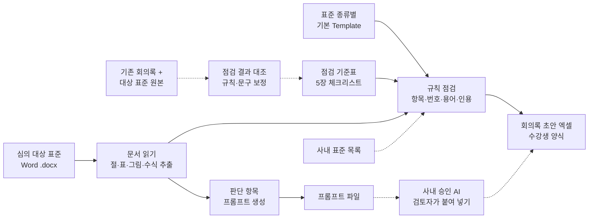
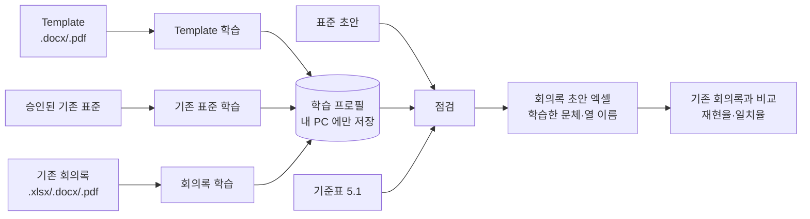

# 기술표준 검토의견 작성 Agent — 프로젝트 기획서

| 항목 | 내용 |
|---|---|
| 리포 | data09-15 |
| 제출자 | 이기욱 |
| 직무·소속 | KBE 기술지식 체계 기획 운영, 기술표준 심의 및 검토의견 작성 |
| 과정 | 현장 데이터 디지털화 전문가과정 1차수 |
| 작성일 | 2026-09-28 (v0.3 개정 2026-09-30) |
| 문서 상태 | 초안 v0.3 — 수강생 실제 자료(양식·표준·초안) 구조 학습 반영, 내 PC 학습 기능(5.4) 추가 |

---

## 1. 추진 배경과 현안

- 기술표준 심의 때 Word 파일로 작성된 **설계표준, 시험검증표준, 가상검증표준**을 평가하고, 그 평가를 바탕으로 **회의록(검토의견)을 엑셀로 작성**하고 있습니다.
- 표준마다 **기본 Template**이 있고, Template의 항목(1항 목적 및 정의 ~ 8항 기타 Appendix)마다 지켜야 할 작성 기준이 정해져 있습니다.
- 수강생이 이미 작성한 회의록과 그 회의록의 대상이 된 표준 원본이 있습니다. 이를 기준으로 삼아, 새 표준이 들어오면 **기초 회의록을 먼저 뽑아 주는 도구**가 필요합니다.
- 운영 조건은 두 가지입니다.
  1. **내 컴퓨터 안에서만** 구동되어야 합니다.
  2. **HDX 사내 폐쇄망** 기준으로 운영되어야 합니다.
- 수강생이 추가 댓글(2026-09-28)로 **평가 내용은 계속 보완되는 것이므로, 평가 내용을 보완하는 방법이 함께 있어야 한다**고 요청했습니다. 평가 기준이 한 번 정해지고 끝나는 것이 아니라 심의를 거듭하며 고쳐지고 늘어난다는 뜻으로 받았습니다.

현재는 검토자가 표준 원문을 처음부터 읽으며 Template 기준 준수 여부를 하나씩 확인하고 지적 사항을 엑셀에 옮겨 적는 것으로 보입니다(가정). 이 경우 표·그림 번호 누락이나 용어 표기 흔들림처럼 **기계적으로 찾을 수 있는 지적**에도 검토 시간이 많이 들고, 검토자마다 지적 수준이 달라질 수 있습니다(가정).

## 2. 목표

### 2.1 최종 목표

- 신규 심의 전, 등록된 표준 원본을 **수강생이 작성해 온 회의록 + 평가 기준(프롬프트)** 에 따라 검토해 **표준에 대한 평가와 기초 회의록**을 출력합니다.
- Template 기준을 지키지 않은 부분은 **「Template 기준으로 이렇게 고치라」는 수정 요청 문구**까지 함께 제시합니다.
- (가능하다면) KBE AI Agent에 등록된 지식에 대해 학습 평가를 해서 AI의 이해력을 확인하고 개선 방안을 도출합니다.
- 모든 처리는 수강생 PC와 사내 폐쇄망 안에서만 이루어지며, 표준 원문이 밖으로 나가지 않습니다.

### 2.2 1차 개발 목표

- 폐쇄망 요건상 **클라우드 AI는 쓰지 않습니다.** 1단계는 수강생 PC에서 인터넷 없이 도는 **로컬 검토 도구**를 만듭니다.
- 평가 기준 중 **규칙으로 확인할 수 있는 항목**(항목 존재·순서, 표/그림 번호, 용어 통일, 인용 표준번호 형식 등)은 도구가 자동으로 점검합니다.
- **판단이 필요한 항목**(목적의 구체성, 1항과 4항의 MECE 등)은 도구가 AI를 직접 부르지 않고, 해당 절 본문과 평가 기준을 묶은 **프롬프트를 만들어 줍니다.** 검토자는 이 프롬프트를 사내에서 사용이 승인된 AI에 붙여 넣어 씁니다.
- 결과는 **수강생의 회의록 양식에 맞춘 회의록 초안 엑셀**로 출력합니다.
- **평가 기준을 코드가 아닌 기준표 파일(엑셀)에 두어** 검토자가 직접 고치고 늘릴 수 있게 하고, 고친 이력과 검토 결과에 대한 검토자 판정(채택/제외)을 쌓아 **어느 기준을 보완해야 하는지** 보여 줍니다(5.3).

## 3. 보유 데이터

| 데이터 | 형태 | 규모·주기 | 비고(민감도 등) |
|---|---|---|---|
| 심의 대상 표준 원문 | Word 파일(설계표준, 시험검증표준, 가상검증표준) | 건수·분량 미상, 심의 때마다 발생 | 사내 기술 문서로 폐쇄망 밖 반출 불가로 가정. 확장자가 .docx인지 구형 .doc도 있는지 미상 |
| 표준별 기본 Template | Word 파일로 가정 | 표준 종류별 1종씩(3종)으로 가정 | 항목 구성과 항목 설명이 평가 기준의 바탕 |
| 기존 회의록 | 엑셀 | 건수 미상 | 수강생이 직접 작성. 열 구성·지적 문구 방식이 출력 양식의 기준 |
| 회의록의 대상이었던 표준 원본 | Word 파일 | 기존 회의록과 짝을 이룸 | 도구의 점검 결과를 실제 회의록과 맞대어 보는 시험 자료 |
| 평가 기준(프롬프트) | 텍스트 | 제출 원문에 항목별로 기술(5장) | 일부 항목이 비어 있음(10장) |
| 사내 표준 목록(번호·제목) | 형태 미상 | 미상 | 인용 표준번호와 제목이 맞는지 대조하려면 필요(가정 — 보유 여부 확인) |
| KBE AI Agent 등록 지식 | 형태 미상 | 미상 | 출력 2(학습 평가)의 대상. 시스템 구성 미상 |

제출 원문에 첨부 파일은 없었습니다. 2026-09-30 수강생이 메일로 실제 자료를 보냈습니다.

| 받은 자료 (2026-09-30) | 형태 | 이번에 한 일 | 보관 |
|---|---|---|---|
| 설계표준 양식 1종, 시험검증표준 양식 1종 (Template) | PDF | 구조만 확인 — 상위·하위 항목, 예시 표시, 머리글 자리표시, 개정 이력 칸 | **원본·내용 미보관** |
| 승인된 기존 표준 2종 | PDF | 구조만 확인 — 용어정의 방식, 인용 문서번호 모양, 캡션 방식, 영문 표기 | **원본·내용 미보관** |
| 표준 초안 1종 | PDF | 학습 결과로 점검해 건수만 확인(개발일지) | **원본·내용 미보관** |
| 기존 회의록 | — | 메일에는 「첨부」라고 적혀 있으나 5개 PDF 안에서 찾지 못함(10장 확인) | — |

- 수강생이 **영업비밀**로 알려 온 자료입니다. 내 PC 임시 폴더에서만 읽고 학습·검증 뒤 **삭제했습니다. 원본은 저장소에 없고**, 이 문서에도 자료의 문구·번호·제목을 옮기지 않았습니다.
- 자료를 저장소에 싣는 대신 **학습 자체를 도구 안으로 옮겼습니다(5.4).** 수강생이 자기 PC 에서 자기 Template·표준·회의록을 넣으면 도구가 그 자리에서 규칙을 뽑아 PC 안에만 저장합니다.

## 4. 해결 방안 개요

| 단계 | 내용 |
|---|---|
| 수집 | 심의 대상 표준(.docx), 표준 종류별 Template, 기존 회의록과 그 대상 표준 원본을 수강생 PC의 지정 폴더에 저장 |
| 정리 | Word 파일에서 절 제목·번호, 본문, 표와 표 캡션, 그림과 그림 캡션, 수식, 용어정의 표를 구조로 뽑아 냄 |
| 분석 | 5장 체크리스트 중 규칙 항목을 자동 점검하고, Template 대비 누락·순서 어긋남과 수정 요청 문구를 만듦 |
| AI | 도구는 AI를 호출하지 않습니다. 판단 항목은 「평가 기준 + 해당 절 본문 + 기존 회의록의 지적 사례」를 묶은 프롬프트로 내보내고, 검토자가 사내 승인 AI에서 실행합니다 |
| 산출물 | 회의록 초안 엑셀, 판단 항목용 프롬프트 파일, 점검 근거(위치·원문 발췌) |

## 5. 주요 기능

### 5.1 평가 기준 체크리스트 (도구가 점검하는 규칙)

제출 원문의 Template 항목별 평가 기준을 그대로 옮긴 표입니다. **이 표가 도구의 점검 규칙이 됩니다.** 점검 방식은 다음 세 가지로 나눴습니다.

- **자동** — 문서 구조와 글자만으로 도구가 판정
- **보조** — 도구가 근거(개수·목록·위치)를 뽑아 보여 주고, 최종 판단은 검토자
- **판단(프롬프트)** — 의미 판단이 필요해 사내 승인 AI용 프롬프트를 생성

| No | Template 항목 | 평가 기준(제출 원문) | 점검 방식 | 1단계 점검 방법 |
|---|---|---|---|---|
| 공통-1 | 전체 | 기본 제공된 Template에 정리된 기준을 준수해야 함 | 자동 | 표준 종류별 Template과 비교해 항목(1항~8항) 존재 여부와 순서 확인 |
| 공통-2 | 전체 | 미준수 시 미준수 내용을 기준 Template 기준으로 수정하라고 멘트 제공 | 자동 | 지적마다 「Template ○항 기준에 따라 …로 수정 바랍니다」 형식의 수정 요청 문구 생성(문구 틀은 기존 회의록에서 가져옴) |
| 1-1 | 1항 목적 및 정의 | 작성된 표준의 목적과 정의를 구체적으로 정리하여, 제목의 내용에 대한 표준 문서의 목적과 정의를 구체적으로 정리해야 함 | 판단(프롬프트) + 보조 | 보조: 항목 존재, 분량, 표준 제목의 핵심어가 1항에 나오는지 표시 / 판단: 목적·정의의 구체성과 제목 부합 여부를 묻는 프롬프트 |
| 2-1 | 2항 관련 표준 및 인용 | 표준의 내용에 관련된 표준과 검토된 기술지식에 대한 문서번호와 제목이 정리되어야 함 | 자동 | 목록 각 줄에 문서번호와 제목이 짝으로 있는지, 번호가 정해진 형식(설정 파일의 정규식)에 맞는지 확인 |
| 3-1 | 3항 용어정의 | 표준에 사용된 용어에 대한 정의로, 일반적인 상식이 아닌 작성된 표준에 적용되는 용어에 대한 정리와 설명이 구체적으로 정리되어야 함 | 보조 + 판단(프롬프트) | 보조: 설명이 비었거나 매우 짧은 용어 표시 / 판단: 일반 상식 수준의 정의인지, 이 표준에 맞게 구체적인지 묻는 프롬프트 |
| 3-2 | 3항 용어정의 ↔ 본문 전체 | 정리된 용어정의는 표준 전체에 동일 기준으로 사용되어야 함. 용어가 통일되게 사용되지 않은 것도 지적 대상 (예: ECU는 계속 ECU로 써야 하며, 한글 「이씨유」 표기 불가) | 자동 | 용어정의 표의 용어를 뽑아 본문 출현 횟수를 세고, 설정 파일의 이형 표기 사전(한글 음차, 대소문자, 약어·원어 혼용)과 맞춰 흔들린 표기와 위치를 목록화. 정의만 있고 본문에 안 쓰인 용어도 표시 |
| 4-1 | 4항 설계절차/시험절차 | 설계절차/시험절차는 설계 방법을 항목 순서 기준으로 정리함 | 자동 + 보조 | 자동: 4항 이하 절 번호(4.1, 4.2, …)가 빠짐·중복 없이 이어지는지 / 보조: 절 제목 목록을 순서대로 보여 줌 |
| 4-2 | 4항 설계절차/시험절차 | 4.1 또는 4.2항에 설계절차, 시험절차를 ISO 기준으로 FlowChart로 제시해야 함 | 자동 + 보조 | 자동: 4.1 또는 4.2 안에 그림이 있고 캡션이 흐름도(FlowChart)로 표시되는지 / 보조: ISO 기호 준수 여부는 그림 판독이 필요해 검토자 확인 항목으로 남김 |
| 4-3 | 4항 이하 | 설계·시험 관련 절차를 정리하며 가능하면 수식으로 제시해야 함 | 보조 | 4항 이하 절별 Word 수식 개수 표시. 「가능하면」이므로 부적합이 아니라 권고로 기재 |
| 4-4 | 4항 이하 | 작성되는 내용 중 그림, 표에는 반드시 표1, 그림(Fig)1 등 번호가 기재되어야 함 | 자동 | 모든 표·그림에 번호 캡션이 있는지, 번호가 빠짐·중복 없이 이어지는지, 본문의 「표 n」「그림 n」 참조가 실제 번호와 맞는지 확인 |
| 4-5 | 1항 ↔ 4항 이하 | 1항 목적 및 범위에 정리된 내용과 4항 이하 설계·시험절차에 정리된 내용을 비교하여 논리적으로 MECE 해야 함 | 판단(프롬프트) | 1항 본문과 4항 이하 절 제목·요지를 나란히 붙여 「빠진 것(누락)과 겹치는 것(중복)을 찾으라」는 프롬프트 생성 |
| 4-6 | 4항 이하 | 구체적 기준에 대해 근거를 명확하게 정량화하여 표현하고, 관련된 표준·법규 등은 반드시 근거를 명확히 제시해야 함. 제시된 표준 No.와 제목이 맞는지 확인 필요 | 자동 + 보조 + 판단 | 자동: 본문에 인용된 표준번호가 2항 목록에 있는지, 사내 표준 목록(확보 시)과 번호-제목이 맞는지 / 보조: 수치 기준이 있는 문장 중 근거 인용이 없는 문장 표시 / 판단: 기준이 정량적인지 묻는 프롬프트 |
| 4-7 | 4항 | (원문 「7)」 이후 내용 없음) | — | 확인 필요(10장) |
| 5-1 | 5항 설계/시험 검증 | 설계 또는 시험 방법에 제시한 사항을 검증하는 방법을 제시해야 함 | 보조 + 판단(프롬프트) | 보조: 5항 존재와 분량 / 판단: 4항 절차마다 대응하는 검증 방법이 있는지 묻는 프롬프트 |
| 5-2 | 5항 설계/시험 검증 | 최대한 정성적이 아닌 정량적 기준으로 관련 근거를 제기해야 함 | 보조 + 판단(프롬프트) | 보조: 5항 문장 중 수치+단위가 있는 문장과 정성 표현(설정 파일의 낱말 목록, 예: 「양호」「적절」)만 있는 문장을 나눠 표시 / 판단: 정량화 여부 프롬프트 |
| 5-3 | 5항 | (원문 「3)」 이후 내용 없음) | — | 확인 필요(10장) |
| 6-1 | 6항 | (원문에 항목명과 기준 「1)」 모두 비어 있음) | 자동(존재만) | 항목명이 정해지기 전까지 Template과 비교한 존재 여부만 점검. 기준은 확인 필요(10장) |
| 7-1 | 7항 안전 관련 사항 | 표준을 설계/시험하며 지켜져야 할 안전 기준에 대해 정리되어야 함 | 보조 + 판단(프롬프트) | 보조: 7항 존재와 분량 / 판단: 안전 기준이 구체적으로 정리되었는지 묻는 프롬프트 |
| 8-1 | 8항 기타(Appendix) | 표준 내용을 보완하여 설명을 추가 | 자동(존재만) | Appendix 존재 여부. 필수 항목인지 선택 항목인지는 확인 필요 |

원문 표기에 대한 해석(가정):

- 3-2 예시는 원문에 「ECU는 계속 EUC로 써야됨」으로 적혀 있으나, 앞뒤 문맥상 ECU의 오기로 보고 ECU로 옮겼습니다(가정).
- 4-6의 「정수화」는 문맥상 「정량화」로 보고 옮겼습니다(가정).
- 1항 명칭이 한 곳에서는 「목적 및 정의」, 4-5에서는 「목적 및 범위」로 되어 있습니다. Template의 정확한 항목명 확인이 필요합니다(10장).
- 4-2의 「ISO 기준」이 어떤 ISO 규격(흐름도 기호 규격 등)을 뜻하는지 원문에 없습니다(10장).

### 5.2 도구 기능

| 기능 | 설명 | 우선순위 |
|---|---|---|
| 표준 문서 읽기 | .docx에서 절 번호·제목, 본문, 표·그림과 캡션, 수식, 용어정의 표를 구조로 추출 | MVP |
| 표준 종류 선택 | 설계표준 / 시험검증표준 / 가상검증표준 중 선택하면 해당 Template과 점검 기준표를 적용 | MVP |
| 규칙 점검 | 5.1의 「자동」「보조」 항목 점검. 점검 규칙과 사전(표준번호 형식, 이형 표기, 정성 표현 낱말)은 설정 파일로 관리해 코드 수정 없이 보완 | MVP |
| 수정 요청 문구 | 부적합 항목마다 Template 기준으로 고치라는 문구 생성 | MVP |
| 판단 항목 프롬프트 생성 | 5.1의 「판단」 항목별로 평가 기준 + 해당 절 본문 + 응답 형식을 묶은 프롬프트를 텍스트 파일로 저장 | MVP |
| 회의록 초안 엑셀 출력 | 수강생 회의록 양식에 맞춰 지적 사항·위치·근거·수정 요청을 채운 엑셀 생성 | MVP |
| 기존 회의록 대조 | 기존 회의록의 대상 표준을 도구에 넣고, 도구 지적과 실제 회의록 지적을 나란히 비교해 규칙을 보정 | MVP(수동 비교) / 확장(자동 비교) |
| AI 응답 되붙이기 | 사내 승인 AI의 응답(정해진 형식)을 엑셀 판단 열에 가져오기 | 확장 |
| 인용 표준 대조 | 사내 표준 목록과 번호-제목 일치 확인 | 확장(목록 확보 시 MVP로 당김) |
| KBE AI Agent 학습 평가 | 등록 지식에 대한 문항을 만들어 AI 응답을 채점하고 개선 방안 도출 | 확장 (가정 — 시스템 구성 확인 후) |
| 평가 기준 보완(기준표 편집) | 5.1 체크리스트를 기준표 엑셀로 내보내고, 검토자가 고친 기준표를 다시 읽어 들여 적용. 바뀐 항목(추가·수정·사용 중지)과 날짜·사유를 이력으로 남김 | MVP (추가 댓글 반영) |
| 검토 결과 판정 되받기 | 회의록 초안 엑셀의 「검토자 판정(채택/제외)」「보완 의견」 열을 검토자가 채워 다시 넣으면 기준별로 누적 | MVP (추가 댓글 반영) |
| 기준 보완 후보 보고 | 누적된 판정에서 제외(오탐)가 많은 기준, 보완 의견이 달린 기준을 모아 보완 후보로 보여 줌 | MVP (추가 댓글 반영) |

### 5.3 평가 기준 보완 방법 (추가 댓글 반영)

수강생 요청(「평가 내용이 지속 보완 가능하므로 보완하는 방법이 추가되면 좋겠다」)에 맞춰, 평가 기준이 심의를 거듭하며 나아지도록 다음 순환을 도구에 넣습니다.

| 순서 | 하는 일 | 도구가 돕는 것 |
|---|---|---|
| 1 | 기준표 꺼내기 | 현재 적용 중인 평가 기준을 엑셀 기준표로 내보냄(No, Template 항목, 평가 기준, 점검 방식, 사용 여부, 수정 요청 문구, 판단 프롬프트 문구, 사전·정규식 값) |
| 2 | 기준 고치기 | 검토자가 엑셀에서 문구를 고치거나, 새 기준 행을 추가하거나, 사용 여부를 「중지」로 바꿈. 비어 있던 4항 7), 5항 3), 6항 기준도 이 방법으로 채움 |
| 3 | 기준표 다시 넣기 | 도구가 이전 기준과 비교해 추가·수정·중지된 항목을 보여 주고 확정하면 적용. 바뀐 내용·날짜·사유를 변경 이력에 남김 |
| 4 | 점검 후 판정 적기 | 회의록 초안의 지적마다 검토자가 「채택」「제외」와 보완 의견을 적음 |
| 5 | 판정 되받기 | 도구가 판정을 기준별로 누적 |
| 6 | 보완 후보 보기 | 제외 비율이 높은 기준(오탐이 많은 기준), 보완 의견이 달린 기준을 목록으로 보여 줌 → 2로 돌아감 |

- 자동 점검 규칙 중 코드가 필요한 것(표·그림 번호 판정 방식 등)은 기준표로 바꿀 수 없으므로, 기준표에서는 **문구·사용 여부·사전·정규식 값**만 고칩니다(가정). 새 판정 방식이 필요한 기준은 「판단(프롬프트)」 방식으로 먼저 추가해 두고, 반복되면 규칙으로 옮깁니다.
- 「보완 후보」로 올리는 제외 비율·최소 건수는 정해진 값이 없어 설정값으로 둡니다.
- 기존 회의록을 대조 자료로 쓰는 것(5.2 기존 회의록 대조)도 이 순환의 첫 입력으로 봅니다.

### 5.4 내 자료 학습 (v0.3 추가)

제출 원문의 「표준별 기본 Template 학습」「내 컴 기반의 AI가 학습」을 **내 PC 안에서 파일 구조와 표기 습관을 세어 규칙으로 바꾸는 방식**으로 구현했습니다. 모델 학습이 아니며 인터넷·AI 호출이 없습니다.

| 학습 | 넣는 파일 | 도구가 뽑는 것(일반 유형) | 점검에 쓰는 곳 |
|---|---|---|---|
| Template 학습 | 표준 종류별 양식 1개 | 상위·하위 항목 목록·순서, 선택 항목(부록 계열), 「예시)」 표시와 예시 문구, 머리글 자리표시(xx·0000 등), 개정 이력 칸 유무, 흐름도가 들어갈 절 | 공통-1(하위 항목 포함), 공통-3 머리글·개정 이력, 공통-4 예시 문구·자리표시 잔재, 4-2 흐름도 절, 표준 종류별 기준 대상 절 옮기기 |
| 기존 표준 학습 | 승인된 표준 여러 개 | 용어정의 목록, 사내 문서번호의 **모양**(영문·숫자 자릿수 — 번호 자체가 아님), 표·그림 캡션 머리말과 괄호 방식, 영문 표기 습관 | 2-1·4-6 번호 인식, 4-4 캡션 인식, 3-2 영문 표기 통일 |
| 회의록 학습 | 기존 회의록 | 지적 범주(구분) 이름과 건수, 문장 끝맺음 유형(…바랍니다 / …필요 / …요망 / …할 것 등), 머리 기호, 위치 표기 방식, 열 역할(순번·구분·위치·의견·조치) | 회의록 초안의 열 이름·구분 이름·수정 요청 문구 끝맺음, 판단 프롬프트의 과거 지적 예, `compare` 일치율 |

- 실제 자료 구조를 보고 **새로 넣은 점검**: 공통-3(머리글 번호·날짜·Rev 자리표시, 개정 이력 날짜 자리표시, 머리글과 개정 이력 불일치), 공통-4(예시 표시·예시 문구 잔재, 본문 자리표시, 「추후 … 예정」 미완성 표기), 하위 항목 누락·이름 다름, 캡션 형식 섞임, 영문 표기(하이픈) 섞임, 한글 용어 띄어쓰기 섞임, 각주 번호가 붙은 용어 인식, 2항 참고 자료 절은 번호 없이 허용. 두 기준(공통-3·공통-4)은 원문 기준표에 없던 것이라 **(가정)** 으로 표시했고 기준표에서 끌 수 있습니다.
- **PDF 읽기**: 실제 자료가 PDF 여서 오프라인 순수 Python 패키지(pypdf)로 글자를 뽑습니다. 쪽마다 되풀이되는 머리글·바닥글을 떼어 따로 보관하고(머리글 점검에 씀), 번호 줄로 절을 찾고, 한 줄에 붙은 캡션 둘을 나눕니다. PDF 에는 표 칸·수식·그림 위치 정보가 없어 「캡션이 아예 없는 표·그림」과 수식 개수는 검토자 확인으로 남깁니다.
- **표준 종류별 항목 번호 차이**: 양식마다 같은 성격의 항목이 다른 번호에 있을 수 있어, 기준표의 「N항 이름」과 학습한 양식의 항목 이름을 맞춰 보고 이름이 맞는 항목으로 대상을 옮깁니다. 그 양식에 없는 항목의 기준은 「해당 없음」으로 표시합니다.
- 학습 프로필은 수강생 PC 의 한 파일(`data/profile.json`)이며 저장소에 올라가지 않습니다(`.gitignore`). 저장소에는 **구조만 흉내 낸 가상 자료**(가상 양식·가상 표준·결함을 심은 가상 초안·가상 회의록)와 그것으로 학습·점검을 확인하는 시험만 있습니다.

## 6. 기대 산출물

1. **기술표준 검토 도구(폐쇄망 로컬)** — 표준 .docx를 넣으면 규칙 점검과 회의록 초안을 만드는 프로그램
2. **평가 기준 체크리스트(설정 파일)** — 5.1 표를 표준 종류별로 담은 점검 기준, 이형 표기·표준번호 형식·정성 표현 사전
3. **회의록 초안 엑셀** — 수강생 회의록 양식 기준의 지적 사항, 위치, 근거, 수정 요청 문구
4. **판단 항목 프롬프트 묶음** — 사내 승인 AI에 붙여 넣어 쓰는 항목별 프롬프트 파일
5. **대조 기록** — 기존 회의록과 도구 결과를 비교한 표(규칙 보정 근거)
6. **기준 보완 기록** — 기준표 변경 이력(추가·수정·중지, 날짜·사유)과 검토자 판정 누적, 보완 후보 보고(5.3)

## 7. 기술 구성

| 과정 도구 | 이 프로젝트에서 쓰는 곳 |
|---|---|
| DAY1 암묵지 자산화·전략기획 | 검토자가 머릿속에 가진 심의 기준과 지적 문구를 5.1 체크리스트와 수정 요청 문구로 꺼내 적기. 비어 있는 4항 7), 5항 3), 6항 기준 채우기 |
| DAY2 코랩(Python)·바이브코딩 | Word 읽기, 규칙 점검, 엑셀 출력 로직 작성 — 이 프로젝트의 중심. 실제 운영은 코랩이 아니라 폐쇄망 PC의 로컬 Python으로 합니다. 코랩은 가상 표준 문서로 로직을 연습할 때만 씁니다 |
| DAY3 멀티모달 비정형 정보화 | 표준 문서의 표·그림·수식 같은 비정형 요소를 구조화해 점검 대상으로 만드는 데 적용 |
| DAY4 RAG (Dify, NotebookLM) | 클라우드 서비스라 적용하지 않습니다. 사내 승인 AI나 KBE AI Agent가 사내 문서 검색을 지원하면 과거 회의록 사례 질의로 검토(확장, 가정) |
| DAY5 Make 자동화 | 클라우드 서비스라 적용하지 않습니다 |
| 생성형 AI | 개발 단계의 코드 작성 보조와, 운영 중에는 검토자가 사내 승인 AI에 프롬프트를 붙여 넣는 방식으로만 씁니다. 도구는 AI를 직접 호출하지 않습니다 |

**개발 형태(권장)**

- **로컬 Python 프로그램**으로 만듭니다. .docx는 압축된 XML 묶음이므로 Python 기본 라이브러리만으로도 절·표·캡션·수식(OMML)을 읽을 수 있습니다. 엑셀 출력에는 openpyxl 같은 패키지가 필요하므로 **설치 파일째 묶어 반입**하거나, 사외에서 실행 파일로 묶어 반입하는 방법을 씁니다(반입 절차 확인 — 10장).
- 점검 규칙, 사전, 수정 요청 문구 틀, 회의록 열 구성은 **설정 파일(엑셀 또는 YAML)** 로 분리합니다. 검토자가 규칙을 직접 고칠 수 있게 하기 위함입니다.
- 구형 .doc 파일은 직접 읽지 않고 Word에서 .docx로 저장한 뒤 넣는 것으로 가정합니다.
- 제출 원문의 「내 컴 기반의 AI가 학습(가능하면 코파일럿)」은 1단계에서 **모델 학습이 아니라, 기존 회의록을 규칙과 프롬프트 예시로 반영하는 방식**으로 대신합니다. 사내에서 Copilot 등 어떤 AI가 승인되어 있는지에 따라 2단계 연결 방식을 정합니다(10장).
- 클라우드 AI, 코랩, 외부 자동화 서비스는 운영 흐름에 넣지 않습니다.

## 8. 개발 단계

### 1단계 — 지금 바로 개발 가능한 부분

표준 원본 없이도, 5.1 체크리스트를 규칙으로 옮긴 **로컬 오프라인 검토 도구**는 지금 만들 수 있습니다. 시험은 Template 항목 구성을 흉내 낸 가상 표준 .docx로 합니다.

- **Word 읽기** — .docx에서 절 번호·제목, 본문 문단, 표와 표 캡션, 그림과 그림 캡션, 수식 개수, 용어정의 표(용어·설명)를 추출
- **항목 존재·순서 점검(공통-1)** — Template 항목 목록(설정 파일)과 비교해 누락·순서 어긋남 지적
- **표·그림 번호 점검(4-4)** — 캡션 유무, 번호 연속성·중복, 본문 참조와 실제 번호 일치
- **용어 통일 점검(3-2)** — 용어정의 표의 용어와 본문 사용 대조, 이형 표기 사전으로 흔들린 표기와 위치 목록화
- **인용 표준번호 형식 점검(2-1, 4-6 일부)** — 번호 형식 정규식 검사, 번호-제목 짝 유무, 본문 인용 번호가 2항 목록에 있는지
- **절 번호 연속성·FlowChart 그림 유무·수식 개수(4-1, 4-2, 4-3)**
- **판단 항목 프롬프트 생성(1-1, 3-1, 4-5, 4-6, 5-1, 5-2, 7-1)** — 항목별로 평가 기준, 해당 절 본문, 응답 형식(판정 / 근거 위치 / 수정 요청)을 묶은 텍스트 파일 저장
- **회의록 초안 엑셀** — 임시 열 구성(No, Template 항목, 평가 기준, 결과[적합/부적합/권고/판단 필요], 지적 내용, 위치, 수정 요청 문구, 검토자 판정, 보완 의견)으로 출력하고, 기존 회의록을 받으면 그 양식으로 바꿈
- **평가 기준 보완(5.3, 추가 댓글 반영)** — 기준표 엑셀 내보내기·다시 넣기(추가·수정·중지 비교와 변경 이력), 회의록 초안의 검토자 판정 되받기, 제외가 많은 기준과 보완 의견을 모은 보완 후보 보고
- **시험용 가상 표준** — 표 번호를 일부러 빠뜨리고, 용어를 「ECU」「이씨유」로 섞어 쓰고, 없는 표준번호를 인용한 가상 문서를 만들어 도구가 각각을 잡는지, 정상 문서에서는 지적이 없는지 확인

### 2단계

**1차 진행(2026-09-30)** — 실제 양식 2종·승인 표준 2종·초안 1종(PDF)으로 구조를 확인해 PDF 읽기와 내 PC 학습(5.4)을 넣었고, 원본은 학습·검증 후 삭제했습니다. 남은 것은 기존 회의록 엑셀로 문체·일치율을 확인하는 일과 가상검증표준 양식입니다.

- 실제 **표준 원본 샘플과 Template 3종**으로 문서 읽기와 항목 인식 보정(절 번호 스타일, 캡션 형식, 용어정의 표 형태) — 설계·시험검증 양식은 1차 반영, 가상검증 양식 미수령
- **기존 회의록 양식**으로 엑셀 출력 전환, 기존 회의록의 지적 문구로 수정 요청 문구 틀 교체
- 기존 회의록과 대상 표준 원본으로 **도구 지적 vs 실제 지적 대조**, 놓친 지적과 불필요한 지적을 보고 규칙 보정
- 비어 있던 기준(4항 7), 5항 3), 6항)을 기준표 보완 방법(5.3)으로 반영
- 실제 심의 몇 차례의 검토자 판정 누적으로 보완 후보 기준과 문구 보정
- 사내 표준 목록 연결(번호-제목 대조), 사내 승인 AI 결정 후 프롬프트 형식 맞춤과 응답 되붙이기
- 폐쇄망 PC 설치·반입 절차 정리

### 3단계

- 표준 종류(설계 / 시험검증 / 가상검증)별 세부 기준 차등
- KBE AI Agent 등록 지식에 대한 학습 평가(문항 생성·응답 채점·개선 방안 도출) — 시스템 구성과 접근 방식 확인 후(가정)
- 심의 이력 누적(표준별 지적 이력, 반복 지적 항목 집계)

## 9. 기대 효과

- **기계적 점검 부담 감소** — 항목 누락, 표·그림 번호, 용어 표기, 인용 번호 형식 같은 지적을 도구가 먼저 찾아 검토자는 판단이 필요한 내용 검토에 집중합니다.
- **검토 기준 일관화** — Template 기준이 체크리스트 한 곳에 정리되어 누가 검토해도 같은 기준으로 지적합니다.
- **회의록 작성 시간 단축** — 지적 위치와 수정 요청 문구가 채워진 회의록 초안에서 시작합니다.
- **암묵지 자산화** — 검토자의 심의 기준과 지적 문구가 설정 파일과 프롬프트로 남아 KBE 기술지식 체계의 일부가 됩니다.
- **보안 요건 충족** — 표준 원문이 수강생 PC와 사내망 밖으로 나가지 않습니다.

제출 자료에는 정량 수치가 없어 이 문서도 수치를 적지 않습니다.

## 10. 확인 필요 사항

**샘플 자료 (필수)**

1. 심의 대상 표준 원본 샘플 — 설계표준, 시험검증표준, 가상검증표준 각 1건 이상(.docx). 실제 문서 반출이 어렵다면 구조만 같은 가짜 문서도 괜찮습니다
2. 표준 종류별 기본 Template 3종 — 항목명, 항목 설명, 절 번호 스타일
3. 기존 회의록 엑셀과 그 회의록의 대상이 된 표준 원본(짝으로 여러 건) — 출력 양식과 지적 문구의 기준, 도구 결과 대조 자료

**평가 기준**

4. 4항 「7)」, 5항 「3)」 이후에 들어갈 기준이 있는지
5. 6항의 항목명과 평가 기준
6. 1항의 정확한 명칭 — 「목적 및 정의」인지 「목적 및 범위」인지
7. 4-2의 「ISO 기준」 FlowChart가 가리키는 ISO 규격과, 도구가 어디까지 확인해야 하는지(그림 유무만인지, 기호 준수까지인지)
8. 3-2 예시의 「EUC」가 ECU의 오기인지, 4-6의 「정수화」가 「정량화」의 뜻인지
9. 8항 Appendix가 필수 항목인지 선택 항목인지
10. 표준번호 표기 형식(사내 표준, 국제·국가 표준, 법규별 번호 규칙)
11. 이형 표기 사전의 초기 목록 — 자주 흔들리는 용어와 허용하지 않는 표기
12. 판정 결과 등급 — 적합/부적합 외에 권고, 판단 필요 같은 구분을 회의록에 쓰는지
13. 평가 기준 보완의 주체와 절차 — 기준을 고치는 사람이 수강생 본인뿐인지, 심의 위원 여럿인지, 기준 변경에 승인이 필요한지(추가 댓글 반영)
14. 보완 후보로 올릴 기준값 — 제외 비율이나 건수에 대한 수강생의 판단 기준(정해진 값이 없으면 설정값으로 둠)

**AI·시스템**

15. 사내에서 사용이 승인된 AI(Copilot 등)가 무엇이고, 표준 원문을 넣어도 되는지 — 프롬프트 형식과 붙여 넣는 방식이 여기에 따라 달라집니다
16. 「내 컴 기반의 AI가 학습」의 뜻 — 모델 학습을 원하는 것인지, 기존 회의록을 참고 예시로 쓰는 수준이면 되는지
17. KBE AI Agent의 구성 — 어떤 시스템이고, 등록 지식과 AI 응답에 수강생이 어떻게 접근할 수 있는지(출력 2)
18. 사내 표준 목록(번호·제목)을 파일로 받을 수 있는지

**운영·환경**

19. 수강생 PC 환경 — 운영체제, Python 설치 여부와 버전, 외부 파일(설치 패키지·실행 파일) 반입 절차
20. 표준 파일 형식 — .docx만인지, 구형 .doc나 PDF도 들어오는지
21. 한 번 심의에 검토하는 표준 건수와 검토 주기

**2026-09-30 자료 관련 (v0.3 추가)**

22. 메일에 적힌 **회의록**이 5개 PDF 안에 없었습니다. 회의록 엑셀(또는 문서)을 따로 보내 주시거나, 내 PC 에서 `learn minutes` 로 직접 학습해 주세요. 같은 초안을 심의한 회의록이면 `compare` 로 일치율을 볼 수 있습니다.
23. **먼저 맞출 표준 종류** — 설계표준 / 시험검증표준 / 가상검증표준 중 어느 것부터 정확도를 높일지. 가상검증표준 양식은 아직 받지 못했습니다.
24. **학습 프로필을 팀에서 함께 쓸지** — 지금은 PC 한 대의 파일입니다. 여러 검토자가 같은 규칙을 쓰려면 사내 공유 폴더에 두고 `--profile 경로` 로 가리키는 방법이 있습니다. 공유 폴더에 둬도 되는 자료인지 확인이 필요합니다.
25. 기준표의 항목 번호(1~8항)가 설계표준 양식과 시험검증표준 양식에서 서로 다릅니다. 도구는 항목 이름으로 대상을 옮기는데, 양식에 없는 기준(예: 안전 관련)은 「해당 없음」으로 둡니다. 종류별로 따로 적용할 기준이 있는지.
26. 승인된 표준에도 캡션 번호 중복·빠짐, 목록에 없는 인용 같은 지적이 나옵니다. 승인 표준을 「정답」으로 볼지, 승인 표준도 점검 대상으로 볼지.
27. 머리글과 개정 이력의 날짜·Rev 를 서로 맞춰야 하는지(도구는 다르면 권고로 표시).

## 부록. 제출 원문 요약

| 출처 | 파일·게시물 | 내용 |
|---|---|---|
| 패들릿 게시물 1 (2026-09-28T08:04) | 「기술표준에 검토의견 작성 Agent」 — `기획_원문.md` | 직무(KBE 기술지식 체계 기획 운영, 기술표준 심의 및 검토의견 작성), 현안(기존 회의록과 프롬프트를 기준으로 사내망에서 기술표준 본문을 저장하고 기초 회의록 출력), 운영기준(내 컴퓨터에서만 구동, HDX 사내 폐쇄망), 개발내용(설계표준·시험검증표준·가상검증표준 Word 평가 후 회의록 엑셀 출력, 기존 회의록·표준 원본 저장, 표준별 기본 Template 학습), 개발필요 사항(Template 준수 평가 프롬프트, 미준수 시 수정 멘트, 1항~8항 항목별 평가 기준 — 4항 7), 5항 3), 6항은 비어 있음), 출력(신규 심의 전 표준 평가 출력, KBE AI Agent 등록 지식 학습 평가를 통한 이해력 확보·개선 방안 도출(가능하다면)) |

| 패들릿 댓글 (2026-09-28T08:24) | 「GitHub 리포지토리 · data09-15」 게시물의 수강생 댓글 | 기획서 초안 확인 의견과 함께, 평가 내용이 지속 보완되므로 **평가 내용을 보완하는 방법**을 추가해 달라는 요청 — 5.2, 5.3, 8장, 10장에 반영 |

| 수강생 메일 (2026-09-30) | 영업비밀 자료 5건(PDF) — 설계표준 양식 1종, 시험검증표준 양식 1종, 승인된 기존 표준 2종, 표준 초안 1종 | 구조만 확인해 5.4 학습 기능과 점검 규칙을 만들고 실제 자료로 검증. **원본은 학습·검증 후 삭제했으며 저장소에 없습니다.** 회의록은 찾지 못함(10장 22) |

패들릿 제출에는 첨부 파일이 없었습니다(`attachments.json` 비어 있음).
